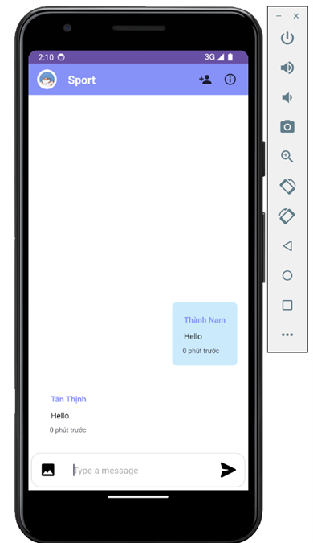
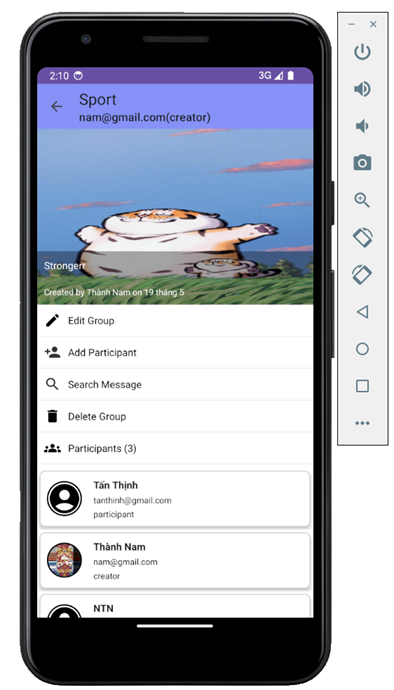

# Social App-v1 📱
  - Công cụ: Android Studio , Firebase , API Stringee
  - Ngôn ngữ : Java

  

# Chức năng

Ứng dụng này dành cho phía người dùng cuối:
  - Xem/tạo/sửa/xoá các bài post đã đăng
  - Tìm kiếm bài post
  - Like/comment/share các bài post
  - Tìm kiếm danh sách bạn bè
  - Nhắn tin, gọi điện thoại qua Audio và Video trực tiếp
  - Gửi tin nhắn hình ảnh
  - Tìm kiếm tin nhắn , xoá tin nhắn
  - Xây dựng trang cá nhân của người dùng(hiển thị các thông tin chi tiết)
  - Chỉnh sửa thông tin của người dùng ngay tại trang cá nhân
  - Xem và nhận thông báo
  - Đăng nhập bằng email/mật khẩu
  - Quên mật khẩu
    
## Công nghệ
Ứng dụng được viết bằng ngôn ngữ Java thuần và sử dụng Firebase làm database và một số thư viện hỗ trợ UI, được xây dựng trên công cụ Android Studio.

## Một vài hình ảnh demo

<div style="display: flex; justify-content: space-around;">
  
  
  
 
    
   
     
     
      
  
</div>

## Hướng dẫn chạy trên máy ảo

1. **Download Android Studio để chạy máy ảo**: [Tải xuống Android Studio ](https://developer.android.com/studio/install?hl=vi)

2. **Download source code bằng câu lệnh**:
```sh
git clone https://github.com/tnamIT299/SocialApp.git
```

## License
MIT
# Các thành viên trong nhóm
  1. Trịnh Thành Nam
  2. Phan Tấn Thịnh


